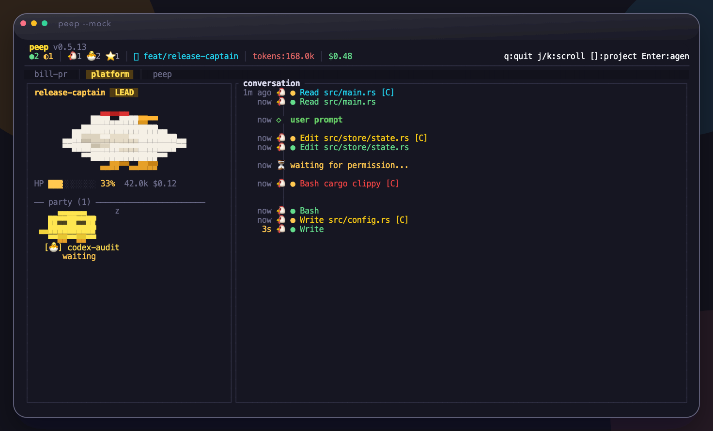
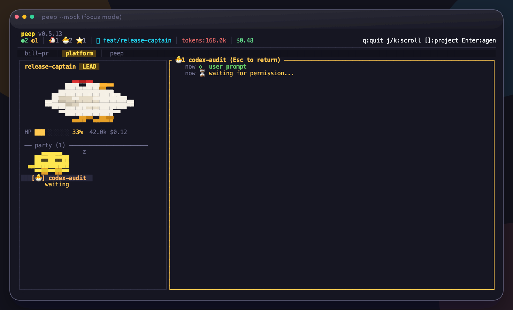
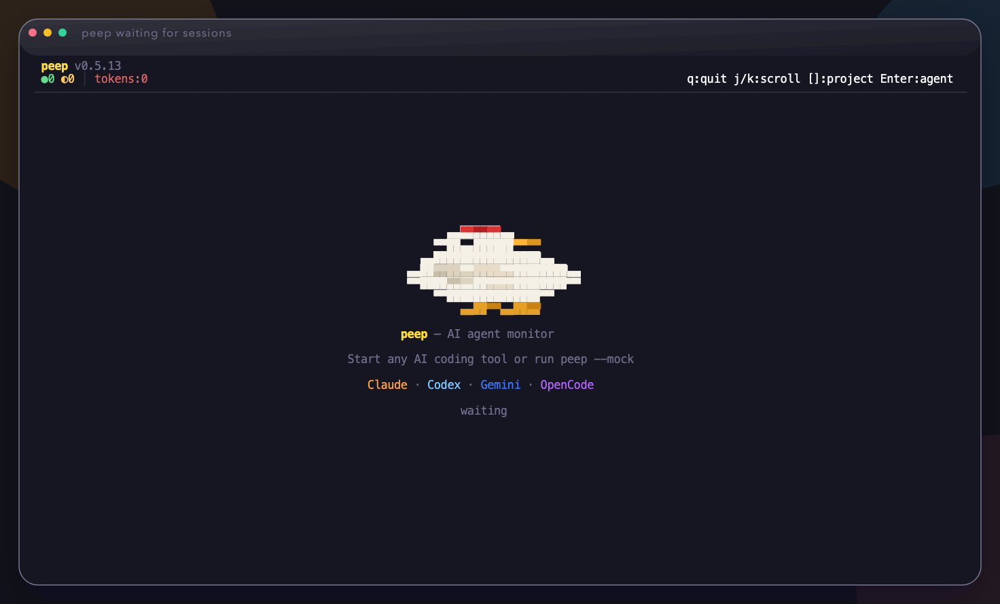

# peep

> Watch AI coding agents work from your terminal

Zero-config terminal dashboard for watching AI coding agents in real time. `peep` reads local session logs from Claude Code, Codex CLI, and Gemini CLI, then turns them into a live party view with pixel-art characters, project tabs, and sub-agent focus mode.



No API keys. No hosted dashboard. No setup ceremony for the default path.

## Try In 30 Seconds

```bash
brew tap jsleemaster/tap
brew install peep
PEEP_NO_AUTO_UPDATE=1 peep --mock
```

`peep --mock` is the fastest way to preview the UI. To watch real work, keep `peep` open while Claude Code, Codex, or Gemini are running normally.

Latest release: <https://github.com/jsleemaster/peep/releases/latest>

## Demo

Sub-agent focus mode:



Empty state and supported tools:



## Why peep

- **Vertical timeline** — Centered spine layout with `│` `●` `◆` `◇` markers
- **Pixel art characters** — Leader agent is a mother hen, sub-agents start as eggs and grow into chicks
- **Sub-agent focus mode** — Select a party member with `Enter` to view their full conversation
- **Multi-project** — Switch between projects with `[` `]` keys
- **Multi-AI support** — Claude Code, Codex CLI, Gemini CLI, OpenCode (auto-detected)
- **Status dots** — Tool running (colored), success (green ●), error (red ●)
- **HP bar** — Context window usage as health bar (auto-resets on session rollover)
- **Dark/Light theme** — Auto-detects or set with `--theme`
- **Auto-update** — Automatically downloads new versions on startup
- **Korean IME support** — Keyboard shortcuts work with Korean input mode
- **Zero config** — Just run `peep`, it auto-discovers local AI session logs

## Prerequisites

peep works **out of the box** with no setup required — it automatically watches JSONL log files that AI coding tools write during sessions.

| Tool | Requirement | Notes |
|------|-------------|-------|
| **Claude Code** | Just use Claude Code normally | Logs auto-written to `~/.claude/projects/` |
| **Codex CLI** | Just use Codex normally | Logs auto-written to `~/.codex/sessions/` |
| **Gemini CLI** | Just use Gemini normally | Logs auto-written to `~/.gemini/logs/sessions/` |
| **OpenCode** | Coming soon | Will watch `.opencode/logs/` |

**No hooks, no config, no API keys needed.** If your AI tool is writing session logs (which they all do by default), peep will find them.

> **Optional**: For lower-latency events, you can configure [HTTP hooks](#claude-code-http-hooks-optional) — but the JSONL watcher is sufficient for most use cases.

## Supported AI Tools

| Tool | Detection | Status |
|------|-----------|--------|
| Claude Code | `~/.claude/projects/**/*.jsonl` | ✅ Full support |
| Codex CLI | `~/.codex/sessions/**/*.jsonl` | ✅ Auto-detected |
| Gemini CLI | `~/.gemini/logs/sessions/` | ✅ Auto-detected |
| OpenCode | `.opencode/logs/` | 🔜 Coming soon |

## How It Reads Data / Privacy

- `peep` watches local JSONL session files by default.
- Nothing needs to be sent to a cloud service for the default experience.
- Optional HTTP hooks exist for lower latency, but they are not required.
- Demo mode is built in: `peep --mock`

## Installation

### Homebrew (recommended)

```bash
brew tap jsleemaster/tap
brew install peep
```

### Download binary

```bash
# macOS (Apple Silicon)
curl -L https://github.com/jsleemaster/peep/releases/latest/download/peep-macos-arm64.tar.gz | tar xz
sudo mv peep /usr/local/bin/

# macOS (Intel)
curl -L https://github.com/jsleemaster/peep/releases/latest/download/peep-macos-intel.tar.gz | tar xz
sudo mv peep /usr/local/bin/

# Linux (x86_64)
curl -L https://github.com/jsleemaster/peep/releases/latest/download/peep-linux-x86_64.tar.gz | tar xz
sudo mv peep /usr/local/bin/

# Linux (arm64)
curl -L https://github.com/jsleemaster/peep/releases/latest/download/peep-linux-arm64.tar.gz | tar xz
sudo mv peep /usr/local/bin/
```

### Cargo (from source)

```bash
cargo install --git https://github.com/jsleemaster/peep
```

## Usage

```bash
# Just run it — auto-discovers AI session logs
peep

# Safe demo without personal logs
PEEP_NO_AUTO_UPDATE=1 peep --mock

# Light theme
peep --theme light

# Custom HTTP hook port
peep --port 4000

# Disable JSONL file watcher (HTTP hooks only)
peep --no-jsonl

# Disable auto-update
PEEP_NO_AUTO_UPDATE=1 peep
```

## Keyboard Shortcuts

| Key | Action |
|-----|--------|
| `q` | Quit |
| `j` / `k` | Scroll conversation |
| `h` / `l` | Focus left/right panel |
| `[` / `]` | Switch project |
| `Enter` | Focus on selected sub-agent (left panel) |
| `Esc` | Return to leader conversation |
| `f` | Filter events |
| `g` / `G` | Scroll to top/bottom |

> **Sub-agent focus**: Press `h` to move focus to the left panel, `j`/`k` to select a party member, then `Enter` to view only that agent's conversation. Press `Esc` to return.

> Korean IME mode also works — `ㅓ`/`ㅏ`/`ㅗ`/`ㅣ`/`ㅂ`/`ㄹ`/`ㅎ` are mapped to `j`/`k`/`h`/`l`/`q`/`f`/`g`.

## How It Works

peep monitors AI agent activity through two channels:

1. **JSONL file watcher** (default) — Watches `~/.claude/projects/`, `~/.codex/sessions/`, `~/.gemini/logs/sessions/` for new log entries. Zero configuration needed.

2. **HTTP hooks** (optional) — Listens on port 3100 for POST requests. Configure in your AI tool's hook settings for real-time events.

### Agent Growth System

Sub-agents evolve based on their usage count:

| Stage | Usage | Character |
|-------|-------|-----------|
| Egg | 0-4 | 🥚 Brand new |
| Cracking | 5-9 | 🪺 Warming up |
| Peeking | 10-19 | 🐥 Head poking out |
| Chick | 20+ | 🐣 Fully hatched |
| Done | completed | ⭐ Trophy |

### Timeline Markers

| Marker | Meaning |
|--------|---------|
| `●` | Main agent event |
| `◆` | Sub-agent event (colored per agent) |
| `◇` | User prompt |
| `│` | Timeline spine |

### Claude Code HTTP Hooks (Optional)

For real-time events, add hooks to `~/.claude/settings.json`:

```json
{
  "hooks": {
    "PostToolUse": [{
      "type": "command",
      "command": "curl -s -X POST http://localhost:3100/hook -H 'Content-Type: application/json' -d \"$CLAUDE_HOOK_EVENT\""
    }]
  }
}
```

## Configuration

Optional config file at `~/.config/peep/config.toml`:

```toml
[server]
port = 3100
bind = "127.0.0.1"

[watcher]
enabled = true
# watch_dir = "~/.claude/projects"

[tui]
tick_rate = 100
```

## Auto-Update

peep automatically checks for updates on startup and upgrades itself. Disable with:

```bash
PEEP_NO_AUTO_UPDATE=1 peep
```

## Requirements

- **OS**: macOS, Linux (Windows via WSL)
- **Terminal**: Any terminal with 256-color or truecolor support
- **AI Tool**: At least one of Claude Code, Codex CLI, or Gemini CLI actively running

## Launch Assets

- Product Hunt launch copy and checklists: [`docs/product-hunt/README.md`](docs/product-hunt/README.md)
- Asset generator: `./scripts/generate_product_hunt_assets.sh`

## License

MIT
